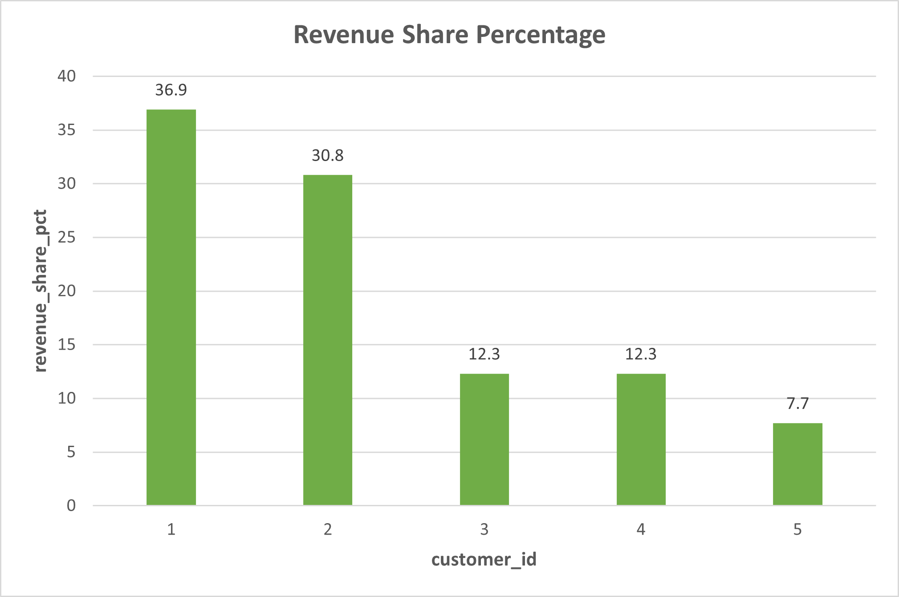
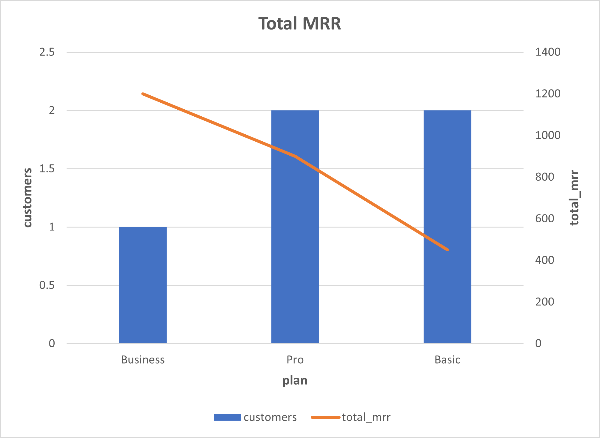

# SaaS Revenue & Retention Analysis
### SQL Portfolio Project

Author: Alice Ng

Tools: SQL (PostgreSQL / BigQuery)

---

## Project Overview

This project analyzes a SaaS-style dataset to evaluate revenue performance, customer retention, acquisition channel efficiency, and customer lifetime value.

The analysis focuses on practical business questions commonly faced by data analysts, including revenue trends, customer concentration, retention behavior, pricing performance, and long-term growth sustainability.

---

## Key Analysis & Insights

### 1. Revenue by Acquisition Channel


#### Insight

Paid and Outbound channels generate the largest share of revenue.

- Paid acquisition contributes the highest total revenue
- Outbound is the second strongest revenue channel
- Referral and Organic channels contribute less revenue overall

This suggests that paid marketing and outbound sales are currently the main growth drivers.

---

### 2. Monthly Revenue Trend


#### Insight

Revenue fluctuates across months rather than growing steadily.

- February records the highest revenue
- January and March are lower by comparison

This pattern may indicate campaign-driven growth or short-term revenue concentration rather than stable recurring growth.

---

### 3. Revenue Share by Customer



#### Insight

Revenue is concentrated among a small number of customers.

- Customer 1 contributes the highest share of revenue
- The top two customers account for over 65% of total revenue

This indicates concentration risk and suggests the business may be exposed if a major customer churns.

---

### 4. MRR Distribution by Subscription Plan



#### Insight

Subscription plans contribute differently to Monthly Recurring Revenue.

- The Business plan generates the highest revenue contribution
- Lower-tier plans have more customers but lower value per customer

This suggests an upsell opportunity from lower-tier plans to higher-value subscriptions.

---

## Business Insights

**Revenue concentration risk**

Revenue is highly concentrated among a small number of customers. This creates exposure to volatility if one or two major accounts churn.

**Customer dependency**

The current revenue structure suggests dependency on several high-value customers rather than a broad and balanced customer base. A more diversified customer mix would reduce risk.

**Growth sustainability**

Although revenue shows periods of growth, long-term sustainability depends on improving retention and expanding the number of paying customers. Sustainable growth should come from a broader customer base, not only a few large contributors.

---

## Dataset Structure

### customers

| column | description |
|------|-------------|
| customer_id | unique customer identifier |
| signup_date | date customer signed up |
| acquisition_channel | marketing channel |
| segment | customer segment |

### payments

| column | description |
|------|-------------|
| customer_id | customer reference |
| payment_date | payment timestamp |
| amount_usd | payment amount |
| status | payment status |

### subscriptions

| column | description |
|------|-------------|
| customer_id | subscriber |
| plan | subscription plan |
| mrr_usd | monthly recurring revenue |

---

# SQL Skills Demonstrated

This project demonstrates practical SQL techniques used in business analysis:

- JOIN operations
- Aggregations using SUM, COUNT, and AVG
- Common Table Expressions (CTEs)
- Window functions
- Cohort retention analysis
- Revenue share and concentration analysis
- SaaS MRR metrics
- Customer lifetime value (LTV) analysis

---

# Tools Used

- SQL (PostgreSQL / BigQuery)
- pgAdmin
- Excel (for charts)
- GitHub (portfolio)

---

# Repository Structure

This project answers key SaaS analytics questions:

```
sql-sales-analysis/
│
├─ sql/
│   ├─ 01_revenue_analysis.sql
│   ├─ 02_cohort_retention.sql
│   ├─ 03_channel_analysis.sql
│   ├─ 04_risk_analysis.sql
│   └─ 05_customer_ltv_analysis.sql
│
├─ images/
│   ├─ revenue_by_channel_chart.png
│   ├─ monthly_revenue_chart.png
│   ├─ revenue_share_chart.png
│   └─ mrr_plan_chart.png
│
├─ report/
│   └─ saas_revenue_retention_analysis_consulting.pdf
│
└─ README.md
```
---

# Business Questions Answered

This project answers key SaaS analytics questions:

- Which acquisition channels generate the most revenue?
- How does revenue evolve over time?
- Are revenues concentrated among a few customers?
- Which subscription plans generate the most MRR?
- How well are customer cohorts retained over time?
- Which channels bring higher-value customers?
- What does customer lifetime value look like across the business?

---

# Project Report

A full analytics report including methodology, SQL explanations, charts, and business insights can be found here:

Full consulting-style analytics report:

report/saas_revenue_retention_analysis_consulting.pdf
---

# GitHub Repository

Full project:

https://github.com/terrynguyen19881215-del/sql-sales-analysis
