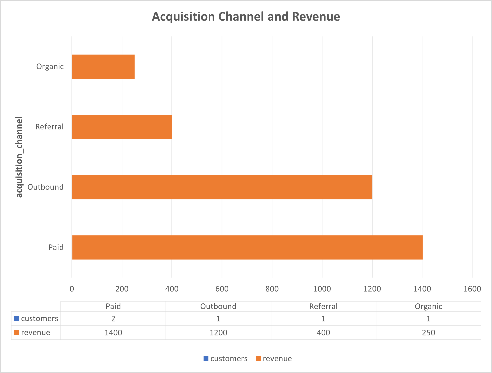
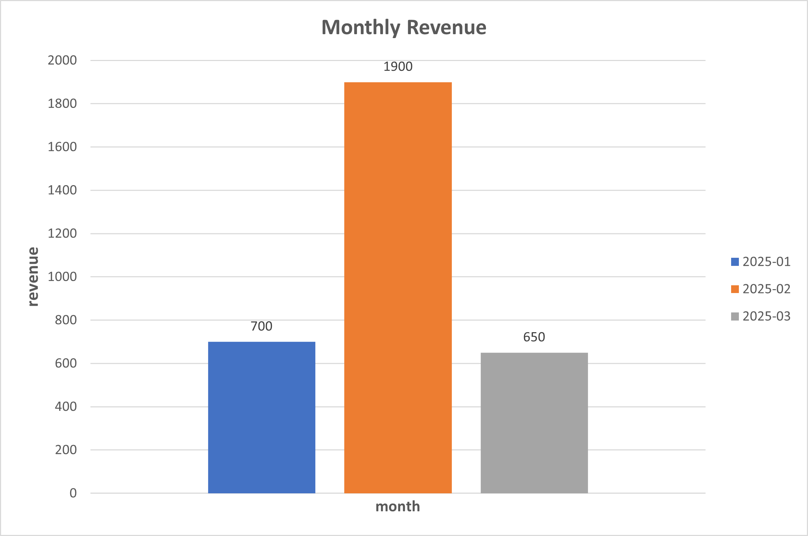

# SQL Portfolio Project #1
## SaaS Revenue & Retention Analysis

Author: Nguyen Giang  
Tools: SQL (PostgreSQL / BigQuery)

---

# Project Overview

This project analyzes a SaaS-style dataset to explore:

- Revenue sources
- Customer contribution
- Monthly revenue trends
- Customer retention behavior
- Subscription value distribution

The analysis demonstrates practical SQL skills used by data analysts in real business scenarios.

---

# Key Analysis & Insights

---

# 1. Revenue by Acquisition Channel

### Insight

Paid and Outbound channels generate the majority of revenue.

- **Paid acquisition contributes the largest share of revenue**
- **Outbound sales is the second most effective channel**
- Referral and Organic channels generate significantly lower revenue

This suggests that **paid marketing and outbound sales are the primary growth drivers**.

---

# 2. Monthly Revenue Trend

### Insight

Revenue fluctuates across months.

- **February shows the highest revenue**
- January and March generate lower revenue

This pattern may indicate **seasonality or a marketing campaign impact during February**.

---

# 3. Revenue Share by Customer

### Insight

Revenue distribution is uneven across customers.

- **Customer 1 contributes the highest share of revenue (~37%)**
- The top two customers contribute **over 65% of total revenue**

This indicates **customer concentration risk**, where revenue depends heavily on a small number of customers.

---

# 4. MRR Distribution by Subscription Plan

### Insight

Subscription plans contribute differently to Monthly Recurring Revenue.

- **Business plan generates the highest revenue per customer**
- **Basic plan has more customers but lower revenue per user**

This suggests a potential strategy:

- Upsell Basic plan users to higher plans
- Encourage adoption of premium plans

---

# Dataset Structure

### customers

| column | description |
|------|-------------|
| customer_id | unique customer identifier |
| signup_date | date customer signed up |
| acquisition_channel | marketing channel |
| segment | customer segment |

---

### payments

| column | description |
|------|-------------|
| customer_id | customer reference |
| payment_date | payment timestamp |
| amount_usd | payment amount |
| status | payment status |

---

### subscriptions

| column | description |
|------|-------------|
| customer_id | subscriber |
| plan | subscription plan |
| mrr_usd | monthly recurring revenue |

---

# SQL Skills Demonstrated

This project demonstrates practical SQL techniques:

- JOIN operations
- Aggregations (SUM, COUNT)
- Window functions
- Cohort analysis
- Revenue share calculation
- SaaS MRR metrics

---

# Tools Used

- SQL (PostgreSQL / BigQuery)
- pgAdmin
- Excel (for charts)
- GitHub (portfolio)

---

# Repository Structure

---

# Business Questions Answered

This project answers key SaaS analytics questions:

- Which acquisition channels generate the most revenue?
- How does revenue evolve over time?
- Are revenues concentrated among a few customers?
- Which subscription plans generate the most MRR?

---

# Project Report

A full project report is available here:

`report/saas_revenue_retention_analysis.pdf`

---

# GitHub Repository

Full project:

https://github.com/terrynguyen19881215-del/sql-sales-analysis
